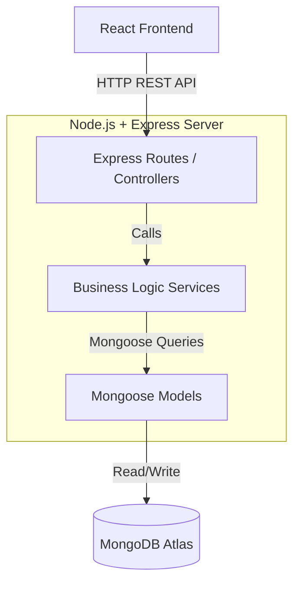
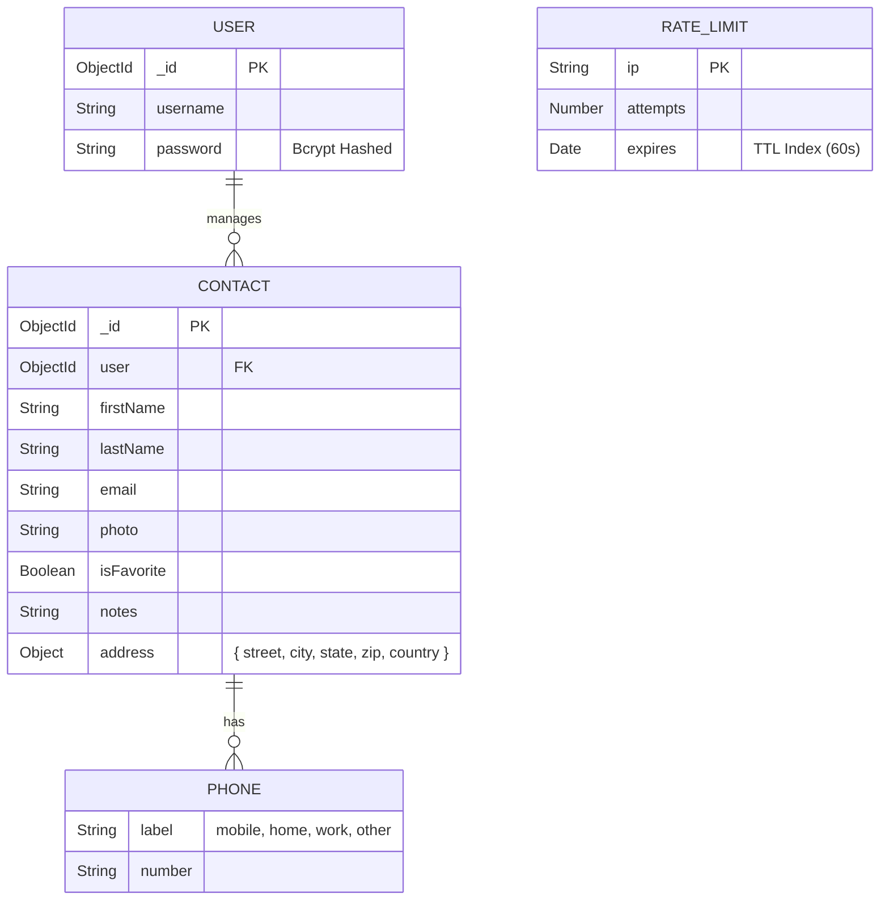

# Phonebook Web Application 📖


A modern, secure, and fully-featured Phonebook application built on the MERN stack. Designed with a sleek light-mode glassmorphism interface, this application allows users to manage their personal contacts, perform predictive searches, upload photos, and import/export their data seamlessly.

Made by Viktoria Cholakova, Martin Gogov, Stilyana Asparuhova, Gabriela Nacheva, Mihaela Tashevska.

---

## ✨ Key Features

- **Predictive Search & Filters:** Real-time client-side filtering by name, phone, email, notes, or **Favorites Only** mode.
- **Dynamic Multiple Phone Numbers:** Store and dynamically categorize multiple numbers (mobile, home, work, other) per contact directly in the creation and edit flows.
- **Media Uploads:** Upload and host contact profile photos.
- **Favorites System:** Mark important contacts with a "Star" for quick visibility.
- **Import / Export Data:** Download all contacts as a CSV file or upload a CSV to bulk-add contacts.
- **Mass Management:** Instantly clear your address book with a secure "Delete All" function.
- **Advanced Stability:** Global error handling and strict IP-based Rate Limiting to prevent brute-force attacks.
- **Authentication:** Secure JWT-based user registration and login, featuring easy navigation back to the Home page.
- **UX Excellence:** Custom Toast notifications, sleek confirmation modals, robust client-side form validation, and a premium **fully responsive design** for mobile devices.

---

## 🛠️ Architecture

The application strictly follows a **Service-Oriented Architecture (SOA)** on the backend, separating HTTP routing concerns from database business logic.

*   `routes/`: Controllers that handle HTTP requests and parameters.
*   `services/`: Encapsulated business logic, queries, and complex algorithms.
*   `models/`: Mongoose schemas defining the data structure.

### System Architecture (SOA)


### Database Schema (ER Diagram)


---

## 🚀 Setup & Installation

### Prerequisites
*   Node.js (v16+ recommended)
*   MongoDB Atlas Account (or local MongoDB)

### 1. Backend Setup
```bash
cd server
npm install
```
Create a `.env` file in the `server` directory:
```env
PORT=5000
MONGODB_URI=your_mongodb_connection_string
JWT_SECRET=your_super_secret_key
```
Start the server:
```bash
npm run dev
```

### 2. Frontend Setup
```bash
cd phonebook-app
npm install
npm run dev
```
The React app will run on `http://localhost:5173`.

---

## 🌐 API Documentation

| Method | Endpoint | Description | Auth Required |
|--------|----------|-------------|---------------|
| POST | `/api/auth/register` | Register a new user | No |
| POST | `/api/auth/login` | Login (Rate-limited) | No |
| GET | `/api/contacts?page=1&limit=50` | Get paginated contacts | Yes |
| POST | `/api/contacts` | Create a new contact | Yes |
| DELETE | `/api/contacts/all` | Delete all user contacts | Yes |
| GET | `/api/contacts/export` | Download contacts as CSV | Yes |
| POST | `/api/contacts/import` | Upload CSV to bulk add | Yes |
| PUT | `/api/contacts/:id/favorite` | Toggle favorite status | Yes |
| POST | `/api/contacts/:id/photo` | Upload a profile photo | Yes |


